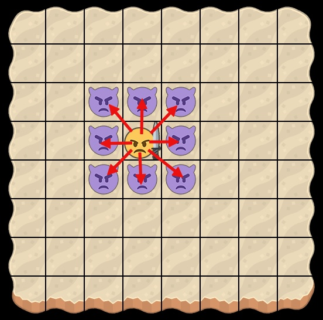
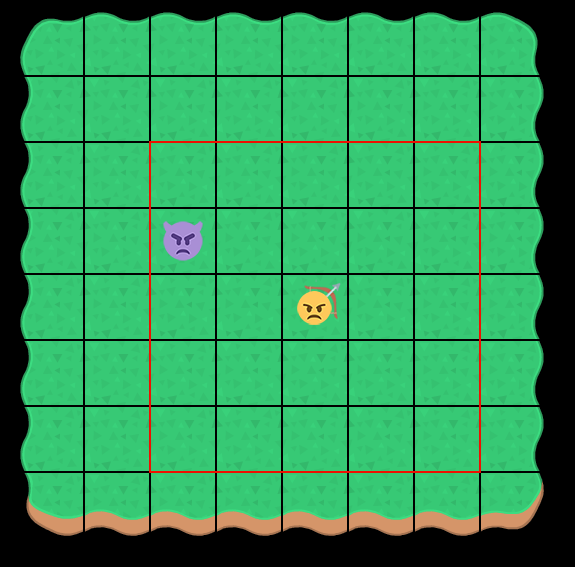
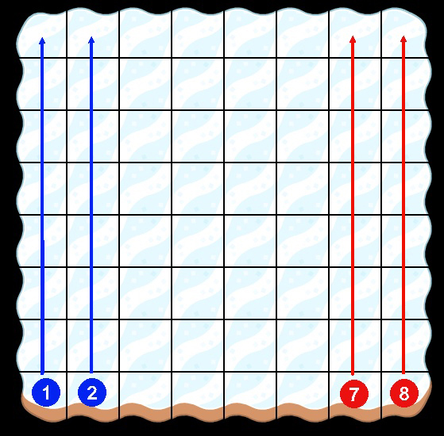
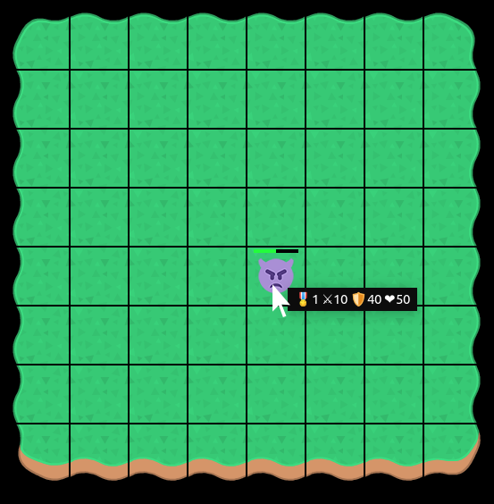

# Retro Game

https://ajoq.github.io/js-retro-game/

## Концепция игры

Двухмерная игра в стиле фэнтези, где игроку предстоит выставлять своих персонажей против персонажей нечисти. После каждого раунда, восстанавливается жизнь уцелевших персонажей игрока и повышается их уровень.

## Механика

Размер поля фиксирован (8x8). Направление движения аналогично ферзю в шахматах. Персонажи разного типа могут ходить на разное расстояние (в базовом варианте можно перескакивать через других персонажей - т.е. как конь в шахматах, единственно - ходим по прямым и по диагонали):
* Мечники/Скелеты - 4 клетки в любом направлении
* Лучники/Вампиры - 2 клетки в любом направлении
* Маги/Демоны - 1 клетка в любом направлении

Дальность атаки так же ограничена:
* Мечники/Скелеты - могут атаковать только соседнюю клетку
* Лучники/Вампиры - на ближайшие 2 клетки
* Маги/Демоны - на ближайшие 4 клетки

Клетки считаются "по радиусу", допустим для мечника зона поражения будет выглядеть вот так:

Для лучника(отмечено красным):

Игрок и компьютер последовательно выполняют по одному игровому действию, после чего управление передаётся противостоящей стороне. Как это выглядит:
1. Выбирается собственный персонаж (для этого на него необходимо кликнуть левой кнопкой мыши)
1. Далее возможен один из двух вариантов:
    1. Перемещение: выбирается свободное поле, на которое можно передвинуть персонажа (для этого на поле необходимо кликнуть левой кнопкой мыши)
    2. Атака: выбирается поле с противником, которое можно атаковать с учётом ограничений по дальности атаки (для этого на персонаже противника необходимо кликнуть левой кнопкой мыши)
    
**Важно: в новой игре игрок всегда начинает первым (если игра загружается из сохранения, то порядок определяется в сохранении).**

Игра заканчивается тогда, когда все персонажи игрока погибают.

Уровень завершается выигрышем игрока тогда, когда все персонажи компьютера погибли.

Баллы, которые набирает игрок за уровень равны сумме жизней оставшихся в живых персонажей.

### Генерация персонажей

Персонажи генерируются рандомно в столбцах 1 и 2 для игрока и в столбцах 7 и 8 для компьютера:

### Уровни

#### Level 1: prairie

У игрока генерируются два персонажа: (случайным образом - типов `Bowman` и `Swordsman`) с уровнем 1, характеристики соответствуют таблице характеристик (см. раздел ниже).

У компьютера генерируется произвольный набор персонажей в количестве 2 единиц.

#### Level 2: desert

У игрока повышается level игроков на 1 + восстанавливается здоровье выживших. Дополнительно случайным образом добавляется новый персонаж уровня 1.

У компьютера случайным образом генерируются персонажи в количестве, равным количеству персонажей игрока, с уровнем от 1 до 2.

#### Level 3: arctic

У игрока повышается level игроков на 1 + восстанавливается здоровье выживших. Дополнительно случайным образом добавляется два новых персонаж уровня 1 или 2.

У компьютера случайным образом генерируются персонажи в количестве, равным количеству персонажей игрока, с уровнем от 1 до 3.

#### Level 4: mountain

У игрока повышается level игроков на 1 + восстанавливается здоровье выживших. Дополнительно случайным образом добавляется два новых персонаж уровня от 1 до 3.

У компьютера случайным образом генерируются персонажи в количестве, равным количеству персонажей игрока, с уровнем от 1 до 4.

### Персонажи

Валидные строковые идентификаторы (к которым привязаны изображения):
* swordsman
* bowman
* magician
* daemon
* undead
* vampire

У игрока могут быть только swordsman, bowman и magician, у компьютера только daemon, undead, vampire.

#### Стартовые характеристики (атака/защита)

* Bowman - 25/25
* Swordsman - 40/10
* Magician - 10/40
* Vampire - 25/25
* Undead - 40/10
* Daemon - 10/40

#### Вывод информации о персонаже

Формат информации:
"🎖1 ⚔10 🛡40 ❤50", где:
* 1 - level
* 10 - значение атаки
* 40 - значение защиты
* 50 - значение жизни

🎖 U+1F396 - медалька (уровень)
⚔ U+2694 - мечи (атака)
🛡 U+1F6E1 - щит (защита)
❤ U+2764 - сердце (уровень жизни)

#### Атака

Урон рассчитывается по формуле: `Math.max(attacker.attack - target.defence, attacker.attack * 0.1)`

#### Level Up

* На 1 повышает поле level автоматически после каждого раунда
* Показатель health приводится к значению: текущий уровень + 80 (но не более 100). Т.е. если у персонажа 1 после окончания раунда уровень жизни был 10, а персонажа 2 - 80, то после levelup:
    * персонаж 1 - жизнь станет 90
    * персонаж 2 - жизнь станет 100
* Повышение показателей атаки/защиты также привязаны к оставшейся жизни по формуле: `attackAfter = Math.max(attackBefore, attackBefore * (1.8 - life) / 100)`, т.е. если у персонажа после окончания раунда жизни осталось 50%, то его показатели улучшаться на 30%. Если же жизни осталось 1%, то показатели никак не увеличаться.

## Описание структуры

Ключевые сущности:
1. GamePlay - класс, отвечающий за взаимодействие с HTML-страницей
1. GameController - класс, отвечающий за логику приложения (важно: это не контроллер в терминах MVC), там вы будете работать больше всего
1. Character - базовый класс, от которого вы будете наследоваться и реализовывать специализированных персонажей
1. GameState - объект, который хранит текущее состояние игры (может сам себя воссоздавать из другого объекта)
1. GameStateService - объект, который взаимодействует с текущим состоянием (сохраняет его, чтобы оно не потерялось при перезагрузке страницы, может экспортировать в файл или загрузить из файла)
1. PositionedCharacter - Character, привязанный к координате на поле. Обратите внимание, что несмотря на то, что поле выглядит как двумерный массив, внутри оно хранится как одномерный (считайте это своеобразным `legacy`, с которым вам придётся бороться)
1. Team - класс для команды (набор персонажей), представляющих компьютер и игрока
1. generators - модуль, содержащий вспомогательные функции для генерации команды и персонажей